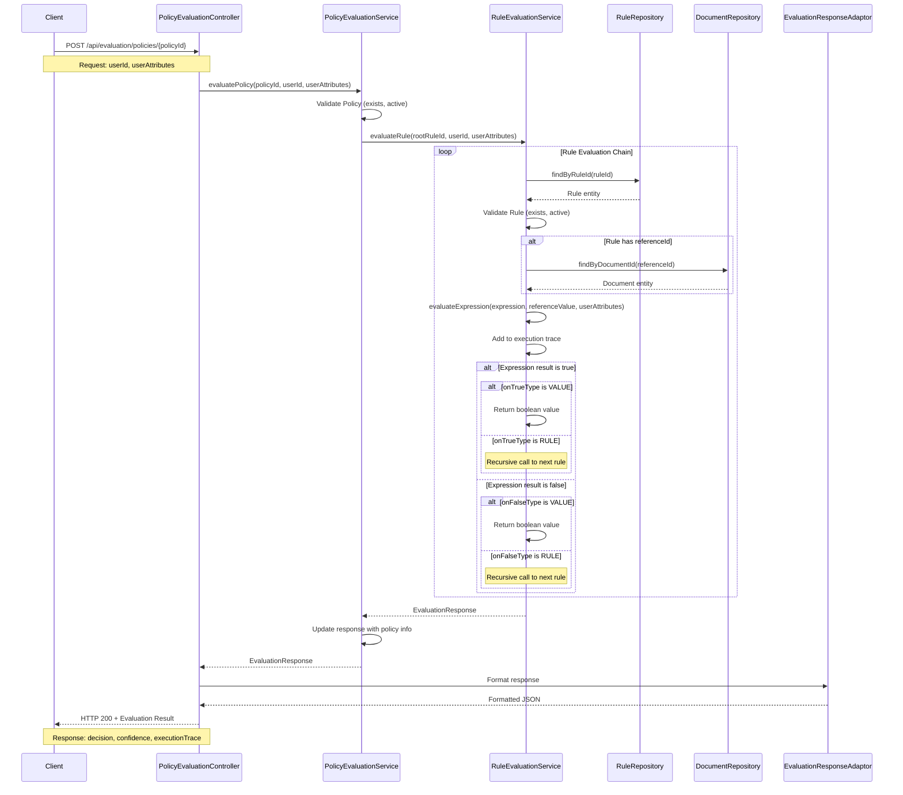
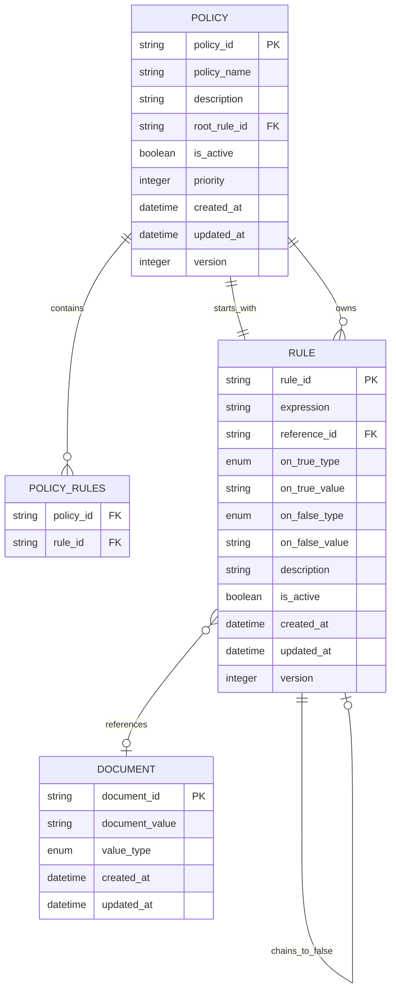
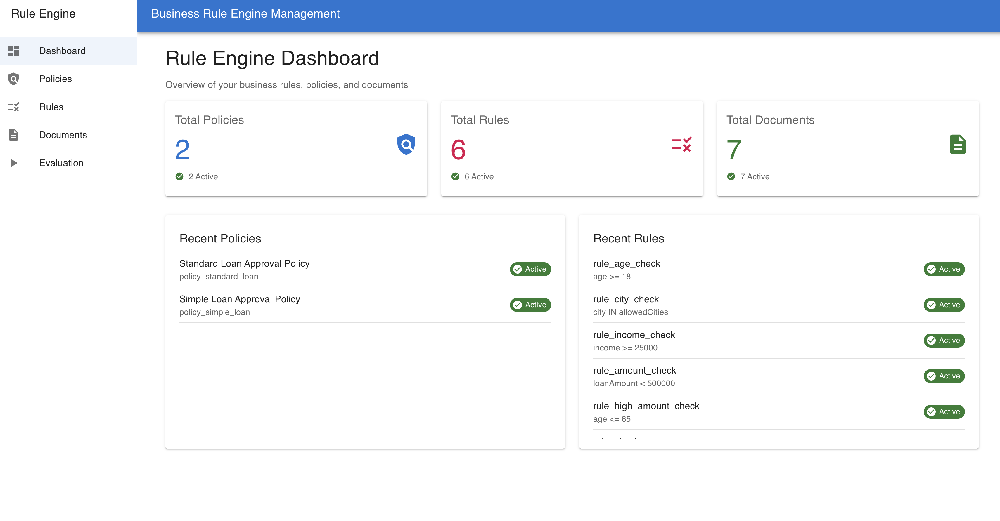

# Rule Engine Service

A flexible, configurable business rule evaluation system designed for automated decision-making processes like loan approvals, policy evaluations, and complex business logic automation.

## 🚀 Quick Start

For setup and local development instructions, see: **[Running Locally Guide](runningLocally.md)**

---

## 📋 Table of Contents

- [Overview](#overview)
- [Architecture Diagrams](#architecture-diagrams)
  - [Policy Evaluation Sequence](#policy-evaluation-sequence-diagram)
  - [Entity Relationships](#entity-relationship-diagram)
- [Key Features](#key-features)
- [Documentation](#documentation)
- [Technology Stack](#technology-stack)
- [Getting Started](#getting-started)

---

## Overview

The Rule Engine Service enables organizations to:

- **Automate Business Decisions**: Replace manual processes with configurable rule-based automation
- **Maintain Audit Trails**: Complete execution traces for compliance and debugging
- **Enable Dynamic Configuration**: Modify business rules without code deployment
- **Support Complex Logic**: Chain rules together to create sophisticated decision trees
- **Ensure Consistency**: Apply the same evaluation criteria across all decisions

**Primary Use Case**: Automated loan approval processing with configurable risk assessment rules.

---

## Architecture Diagrams

### Policy Evaluation Sequence Diagram



### Entity Relationship Diagram



---

## Key Features

### 🔧 **Dynamic Rule Management**
- Create, update, and delete rules through REST APIs
- Activate/deactivate rules without system restart
- Version control and audit trails for all changes

### 🔗 **Flexible Rule Chaining**
- Rules can chain to other rules or return terminal values
- Support for complex decision trees and conditional logic
- Circular dependency detection and prevention

### 📊 **Multiple Expression Types**
- **Comparison Operators**: `>`, `>=`, `<`, `<=`, `==`, `!=`
- **List Membership**: `IN` operator for multi-value checks
- **Boolean Evaluation**: Direct boolean attribute checks
- **Reference-Based**: Dynamic values from external documents

### 🎯 **Policy-Based Evaluation**
- Group related rules into policies
- Multiple evaluation strategies (single rule, policy, bulk)
- Priority-based policy resolution

### 📋 **Comprehensive Audit Trail**
- Step-by-step execution traces
- Decision reasoning and confidence scores
- Complete request/response logging
- Regulatory compliance support

### 🔍 **Advanced Search & Analytics**
- Search rules by expression patterns
- Filter by activation status and creation date
- Bulk operations for policy comparison

---

## User Interface

The Rule Engine includes a modern, intuitive web interface for managing rules, policies, and evaluations without requiring technical knowledge.



## Documentation

### 🎨 **For End Users & UI Teams**

| Document | Description |
|----------|-------------|
| **[UI Usage Guide](uiUsage.md)** | Complete user interface walkthrough with screenshots of all major features. Covers dashboard overview, rule management, policy creation, document handling, and evaluation workflows. Includes frontend repository link and setup instructions. |

### 📚 **For Developers & Architects**

| Document | Description |
|----------|-------------|
| **[Internal Working Guide](internalWorking.md)** | Deep-dive into architecture, algorithms, and design patterns. Covers the recursive evaluation engine, expression parsing, circular dependency prevention, and extensibility points. Essential for developers working on the codebase. |

### 🔌 **For Integration & Client Teams**

| Document | Description |
|----------|-------------|
| **[API Documentation](apiDoc.md)** | Complete REST API reference with 30+ endpoints across Rules, Policies, Documents, and Evaluation. Includes sample cURL commands, request/response schemas, and integration guidelines. Ready for client integration. |

### 🛠️ **For DevOps & Setup**

| Document | Description |
|----------|-------------|
| **[Local Development Setup](runningLocally.md)** | Step-by-step guide for setting up the development environment, running the service locally, and accessing development tools like Swagger UI and H2 Console. |

---

## Technology Stack

### Core Technologies
- **Java 17**: Modern Java features and performance
- **Spring Boot 3.x**: Framework for REST APIs and dependency injection
- **Spring Data JPA**: Database abstraction and ORM
- **H2 Database**: In-memory database for development/testing
- **Maven**: Build and dependency management

### Development Tools
- **Swagger/OpenAPI**: Interactive API documentation
- **Lombok**: Boilerplate code reduction
- **SLF4J/Logback**: Logging framework
- **Jackson**: JSON serialization/deserialization

### Architecture Patterns
- **Multi-module Maven Project**: Clear separation of concerns
- **Layered Architecture**: Controller → Service → Repository
- **Repository Pattern**: Data access abstraction
- **Adapter Pattern**: DTO-Entity conversion
- **Strategy Pattern**: Pluggable expression evaluation

---

## Getting Started

### Prerequisites
- Java 17 or higher
- Maven 3.6+ 
- IDE (IntelliJ IDEA recommended)

### Quick Setup
```bash
# Clone the repository
git clone <repository-url>
cd rule-engine

# Build the project
mvn clean install

# Run the application
mvn spring-boot:run -pl ruleengine-controller

# Access the application
# API: http://localhost:8080
# Swagger UI: http://localhost:8080/swagger-ui.html
# H2 Console: http://localhost:8080/h2-console
```

### First API Call
```bash
# Evaluate a policy (example)
curl -X POST http://localhost:8080/api/evaluation/policies/policy_loan_approval \
  -H "Content-Type: application/json" \
  -d '{
    "userId": "user123",
    "userAttributes": {
      "age": 25,
      "income": 50000,
      "creditScore": 750,
      "employmentStatus": "employed"
    }
  }'
```

### Development Workflow
1. **Setup Environment**: Follow the [Running Locally Guide](runningLocally.md)
2. **Explore APIs**: Use Swagger UI at `http://localhost:8080/swagger-ui.html`
3. **Integration**: Reference [API Documentation](apiDoc.md) for client integration
4. **Deep Dive**: Study [Internal Working Guide](internalWorking.md) for architecture details

---

## Project Structure

```
rule-engine/
├── ruleengine-controller/    # REST API controllers and configuration
├── ruleengine-service/       # Business logic and rule evaluation engine  
├── ruleengine-repository/    # Data access layer and JPA repositories
├── ruleengine-models/        # Domain entities and DTOs
├── apiDoc.md                 # API documentation for clients
├── internalWorking.md        # Architecture and internal design guide
├── runningLocally.md         # Development setup guide
└── README.md                 # This file
```

---

## Support & Contributing

For technical support, questions, or contributions:

1. **Setup Issues**: Check [Running Locally Guide](runningLocally.md)
2. **API Integration**: Reference [API Documentation](apiDoc.md)  
3. **Architecture Questions**: See [Internal Working Guide](internalWorking.md)
4. **Development**: Use Swagger UI and H2 Console for testing

---

**Built with ❤️ for flexible, auditable business rule automation**
