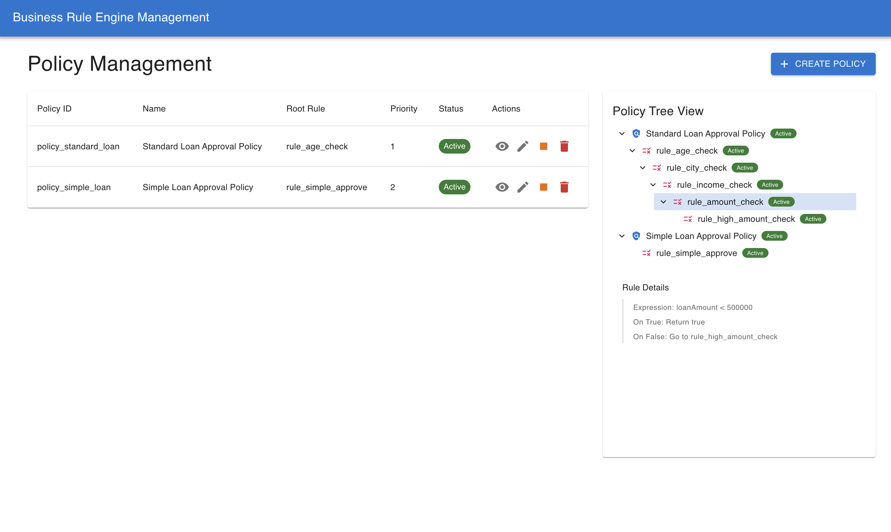
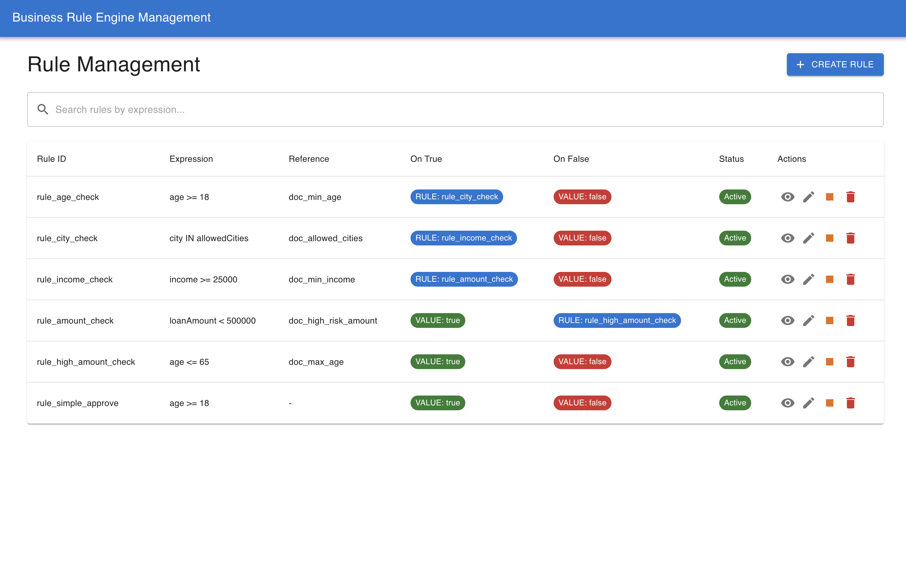
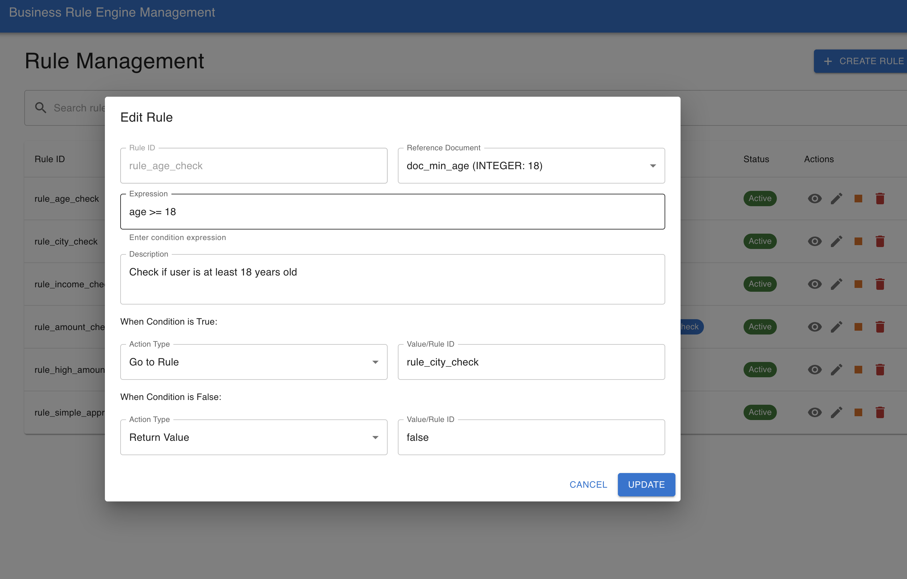
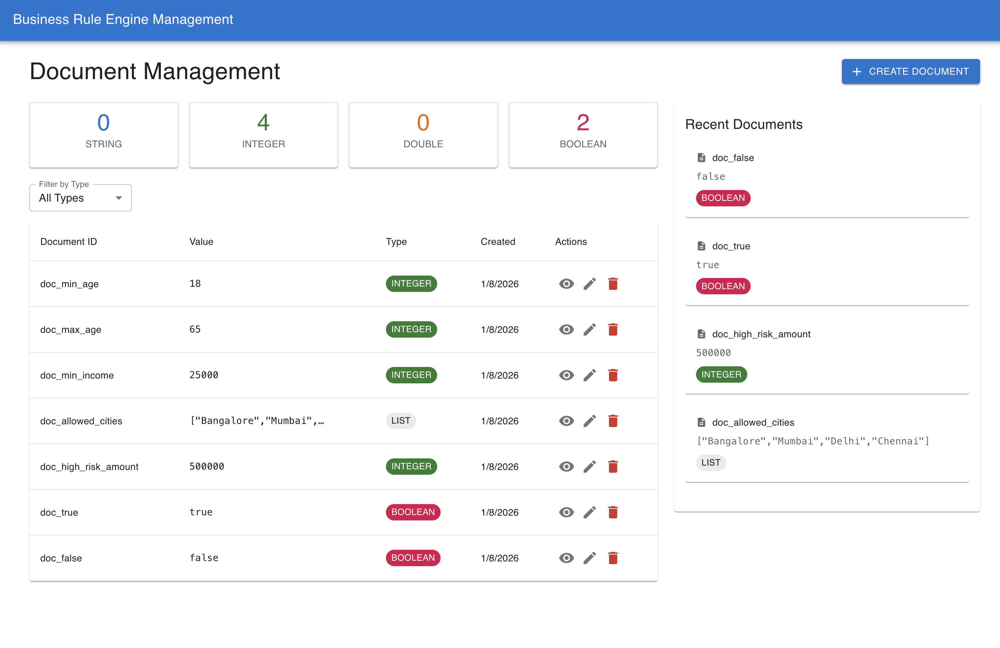
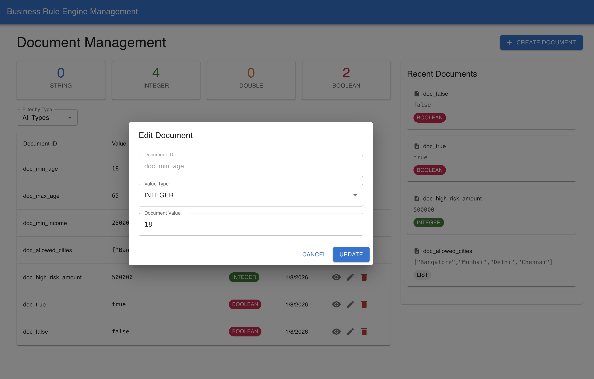
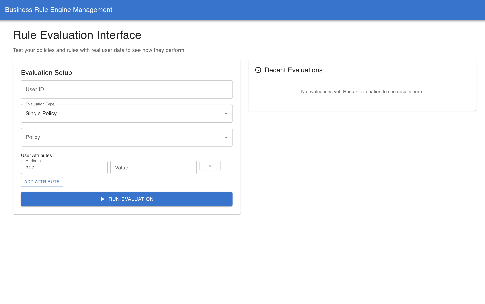

# Rule Engine UI - User Interface Guide

This document showcases the Rule Engine Frontend application interface and user workflow. The UI provides an intuitive way to interact with the Rule Engine Service, allowing users to manage rules, policies, documents, and perform evaluations through a modern web interface.

---

## Dashboard Overview

The main dashboard provides a comprehensive view of the Rule Engine system with quick access to all major functions.

---

## Rule Management Interface

The rule management section allows users to create, edit, and manage business rules through an intuitive form-based interface. Users can define rule expressions, set conditions, and configure outcomes.

---

## Rule Creation Form

A detailed form for creating new rules with fields for rule ID, expressions, reference documents, and outcome configurations. The interface provides validation and guidance for proper rule definition.

---

## Policy Management

The policy management interface enables users to create and manage policies by grouping related rules together. Users can define policy hierarchies and set root rules for evaluation.

---

## Document Management

Document management interface for handling reference values and configuration data used by rules. Users can create, edit, and organize documents with different data types.

---

## Rule Evaluation Interface

Interactive evaluation interface where users can test rules and policies by providing user attributes and seeing real-time evaluation results with execution traces.

---

## Evaluation Results & Trace

Detailed results view showing evaluation outcomes, decision reasoning, confidence scores, and complete execution traces for audit and debugging purposes.

---

## Key UI Features

### 🎯 **Intuitive User Experience**
- Clean, modern interface design
- Form-based rule and policy creation
- Real-time validation and feedback
- Responsive design for various screen sizes

### 📊 **Visual Rule Management**
- Tabular views for easy rule browsing
- Search and filter capabilities
- Inline editing and quick actions
- Status indicators for active/inactive rules

### 🔍 **Interactive Evaluation**
- Live evaluation testing interface
- User-friendly attribute input forms
- Real-time results display
- Detailed execution trace visualization

### 📋 **Comprehensive Management**
- Complete CRUD operations for all entities
- Bulk operations support
- Import/export capabilities
- Audit trail and history tracking

### 🎨 **Professional Design**
- Consistent UI components and styling
- Intuitive navigation and workflows
- Loading states and error handling
- Accessible design principles

---

## Frontend Technology Stack

- **React**: Modern component-based UI framework
- **Material-UI**: Professional component library
- **Axios**: HTTP client for API communication
- **React Router**: Client-side routing
- **Form Handling**: Controlled forms with validation
- **State Management**: React hooks and context

---

## Getting Started with the UI

1. **Backend Setup**: Ensure the Rule Engine Service is running on `http://localhost:8080`
2. **Frontend Installation**: Clone and set up the frontend repository
3. **Configuration**: Configure API endpoints to point to your backend
4. **Launch**: Start the development server and access the interface
5. **Explore**: Navigate through the different sections to manage rules and policies

---

## UI Workflow

### Rule Creation Workflow
1. Navigate to Rule Management section
2. Click "Create New Rule" 
3. Fill in rule details and expressions
4. Configure true/false outcomes
5. Save and activate the rule

### Policy Creation Workflow  
1. Access Policy Management interface
2. Define policy name and description
3. Select root rule for evaluation start
4. Add related rules to the policy
5. Set priority and activate policy

### Evaluation Workflow
1. Go to Evaluation section
2. Select policy or rule to evaluate
3. Input user attributes in the form
4. Execute evaluation
5. Review results and execution trace

---

## For Frontend Development

**🔗 Frontend Repository**: For complete frontend source code, setup instructions, and development guidelines, visit:

**[Rule Engine Frontend Repository](https://github.com/sahilsgovekar/rule-engine-FE)**

The frontend repository contains:
- Complete React application source code
- Setup and installation instructions
- Development and deployment guidelines
- Component documentation and examples
- API integration patterns and best practices
